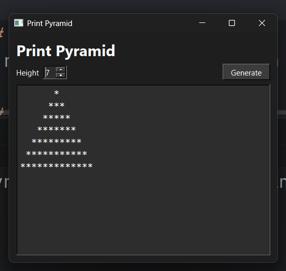

# Pyramid of Stars


A small Qt Widgets application for generating a centered text pyramid with stars.

The app lets you choose a height and displays the pyramid in a
monospace text area.

## Requirements

- Windows
- CMake 4.2 or newer
- C++17 compiler
- Qt 6 with the Widgets module

This project is currently configured for a local Qt install at:

```text
Qt/6.11.1/mingw_64/lib/cmake
```

If Qt is installed somewhere else, update `CMAKE_PREFIX_PATH` in
`CMakeLists.txt` or pass it when configuring CMake.

## Run
Run using the run config in CLion.

## Build
[Build_doc](./doc/Build.md)

## Screenshot


## Example Output

For height `3`:

```text
  *
 ***
*****
```